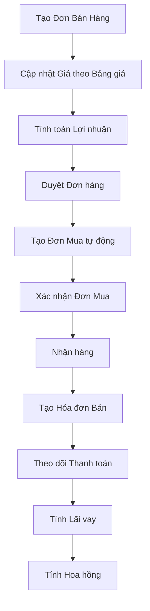

# NSG Sale Module - Technical Documentation

**Module Name:** NSG Sale (Kinh Doanh Thép Nam Sài Gòn)  
**Version:** 0.0.1  
**Category:** Sale  
**Author:** thanhchatvn@gmail.com  
**Application:** Odoo 18  
**License:** OPL-1

---

## 📋 Tổng Quan Module

Module **NSG Sale** là một giải pháp quản lý bán hàng chuyên biệt dành cho ngành kinh doanh thép, được phát triển cho Công ty Nam Sài Gòn. Module này mở rộng các chức năng cơ bản của Odoo để phù hợp với quy trình kinh doanh đặc thù của ngành thép.

### Dependencies
- `sale_margin`, `sale_stock_margin`, `sale_expense_margin`
- `purchase`, `delivery`, `sale_purchase_inter_company_rules`
- `sale_purchase`, `sale_stock`, `account_reports`, `account_followup`

---

## 🏗️ Cấu Trúc Module

```
ngs_sale/
├── __manifest__.py                 # Manifest file
├── models/                         # Các model chính
│   ├── sale_order.py              # Đơn bán hàng (core)
│   ├── sale_commission_tool.py    # Công cụ hoa hồng
│   ├── sale_order_fee.py          # Chi phí đơn hàng
│   ├── sale_processing_state.py   # Trạng thái xử lý
│   ├── sale_barem.py              # Bảng barem
│   ├── product_template.py        # Sản phẩm
│   ├── product_pricelist.py       # Bảng giá
│   ├── account_payment_term.py    # Điều khoản thanh toán
│   ├── purchase_order.py          # Đơn mua hàng
│   ├── res_partner.py             # Khách hàng/Nhà cung cấp
│   ├── res_company.py             # Công ty
│   ├── account_move.py            # Hóa đơn
│   ├── account_move_line.py       # Dòng hóa đơn
│   ├── supplier_delivery_type.py  # Loại giao hàng
│   └── res_config_settings.py     # Cấu hình hệ thống
├── views/                          # Giao diện
│   ├── sale_order.xml             # Giao diện đơn bán
│   ├── account_move.xml           # Giao diện hóa đơn
│   ├── purchase_order.xml         # Giao diện đơn mua
│   └── [other view files]
├── wizards/                        # Các wizard
│   ├── import_sale_order.py       # Import đơn hàng
│   └── account_partner_reconciliation.py # Đối chiếu công nợ
├── reports/                        # Báo cáo
│   ├── report_sale_order.xml      # Báo cáo đơn bán
│   ├── account_invoice_report.py  # Báo cáo hóa đơn
│   └── invoice_payment_analysis_report.py # Phân tích thanh toán
├── datas/                          # Dữ liệu cơ sở
│   ├── config_parameter.xml       # Tham số cấu hình
│   ├── res_partner_type_datas.xml # Loại khách hàng
│   └── [other data files]
└── security/                      # Phân quyền
    ├── ir.model.access.csv        # Quyền truy cập model
    └── ir_rules.xml               # Quy tắc bảo mật
```

---

## 🔧 Chức Năng Chính

### 1. **QUẢN LÝ ĐƠN BÁN HÀNG (Sale Order)**

#### **Model: `sale.order`**

**Các trường bổ sung:**
- `state`: Thêm trạng thái 'approved' (Đã duyệt)
- `margin`, `margin_percent`: Tính toán lợi nhuận chi tiết
- `purchase_pricelist_id`: Bảng giá mua liên kết
- `shipping_cost`, `xltl`: Chi phí vận chuyển và xử lý
- `sale_type`: Kiểu mua bán (5 loại khác nhau)
- `supplier_id`: Nhà cung cấp chính
- `margin_each_unit`: Lợi nhuận trên 1 kg
- `seller_commission`: Hoa hồng nhân viên kinh doanh
- `total_product_qty`: Tổng khối lượng (kg)
- `interest_amount`, `interest_per_kg`: Lãi vay và lãi vay/kg
- `invoice_state`, `invoice_posted_date`: Trạng thái và ngày thanh toán

**Các phương thức quan trọng:**

1. **`action_approve()`**
   - Chuyển đơn hàng sang trạng thái 'Đã duyệt'

2. **`_get_invoice_information()`**
   - Tính toán thông tin thanh toán từ hóa đơn
   - Xác định trạng thái thanh toán và ngày thanh toán cuối cùng

3. **`action_create_purchase_order()`**
   - Tự động tạo/cập nhật đơn mua hàng từ đơn bán
   - Liên kết các sản phẩm, số lượng, giá cả
   - Xử lý logic phức tạp cho việc mapping sản phẩm

4. **`calculate_interest()`**
   - Tính toán lãi vay dựa trên:
     - Số ngày chậm thanh toán
     - Lãi suất từ điều khoản thanh toán
     - Số tiền còn nợ theo từng lần thanh toán
   - Cập nhật `price_landing` cho từng dòng đơn hàng

5. **`action_update_prices()`**
   - Cập nhật giá bán theo bảng giá
   - Tính toán giá gốc, lợi nhuận tối thiểu
   - Xử lý các loại kiểu mua bán khác nhau

6. **`import_from_excel()`**
   - Import đơn hàng từ file Excel
   - Tạo đơn hàng và các dòng sản phẩm tự động

#### **Model: `sale.order.line`**

**Các trường bổ sung:**
- `discount_value`: Chiết khấu tiền mặt
- `price_landing`: Lãi vay (đ/kg)
- `price_shipping`: Chi phí vận chuyển (đ/kg)
- `quantity_extra`: Khối lượng chênh lệch
- `base_price`: Giá gốc (mua vào)
- `quantity_another1`, `quantity_another2`, `quantity_another3`: Các đơn vị đo khác nhau
- `cost_price`: Chi phí khác
- `purchase_amount`: Tiền mua
- `length`: Chiều dài (m)
- `supplier_id`: Nhà cung cấp cho sản phẩm
- `supplier_delivery_type_id`: Quy cách giao hàng

**Các phương thức quan trọng:**

1. **`_compute_margin()`**
   - Tính toán lợi nhuận chi tiết cho từng dòng
   - Xử lý các loại chiết khấu và hoa hồng
   - Tính toán theo công thức phức tạp cho ngành thép

2. **`_onchange_quantity_another1()`**
   - Tự động tính toán các số lượng liên quan
   - Xử lý chuyển đổi giữa các đơn vị đo

### 2. **HỆ THỐNG HOA HỒNG (Commission System)**

#### **Model: `sale.commission.tool`**

**Chức năng chính:**
- Quản lý chu kỳ tính hoa hồng (tháng/quý)
- Tự động tính toán hoa hồng cho nhân viên
- Áp dụng chiết khấu nhà cung cấp
- Tạo phiếu chi hoa hồng

**Các phương thức quan trọng:**

1. **`action_compute_commission()`**
   - Tìm kiếm đơn hàng trong khoảng thời gian
   - Tính toán hoa hồng theo cấu hình
   - Áp dụng chiết khấu cho từng danh mục sản phẩm

2. **`make_payment()`**
   - Tạo phiếu chi hoa hồng tự động
   - Liên kết với sổ nhật ký kế toán

#### **Model: `sale.commission.config`**
- Cấu hình chiết khấu theo nhà cung cấp và danh mục sản phẩm

#### **Model: `sale.commission.user`**
- Lưu trữ kết quả tính hoa hồng cho từng nhân viên

### 3. **QUẢN LÝ SÁCH GIÁ (Pricelist Management)**

#### **Model: `product.pricelist`**
- Phân loại bảng giá: Mua/Bán
- Hỗ trợ chiết khấu tiền mặt

#### **Model: `product.pricelist.item`**
- `discount_value`: Chiết khấu tiền mặt
- Override `_compute_price()` để tính giá sau chiết khấu

### 4. **QUẢN LÝ ĐƠN MUA HÀNG (Purchase Order)**

#### **Model: `purchase.order`**

**Các trường bổ sung:**
- `sale_id`: Liên kết với đơn bán hàng
- `sale_reference_id`: Đơn bán hàng tham chiếu (cho chi phí)
- `advance_state`: Trạng thái tạm ứng
- `total_product_qty`: Tổng khối lượng
- `commission_tool_id`: Phiếu hoa hồng

**Các phương thức quan trọng:**

1. **`button_approve()`**
   - Cập nhật chi phí cho đơn bán hàng liên quan
   - Giữ nguyên ngày duyệt tùy chỉnh

2. **`_rebuild_cost()`**
   - Tính toán lại chi phí từ đơn mua sang đơn bán

### 5. **QUẢN LÝ HÓA ĐƠN (Invoice Management)**

#### **Model: `account.move`**

**Các trường bổ sung:**
- `no_output_invoice`: Không xuất hóa đơn
- `posted_date`: Ngày thanh toán thực tế
- `tag_ids`: Thẻ phân loại
- `total_quantity`: Tổng khối lượng
- `order_received_date`: Ngày nhận hàng từ đơn bán
- `invoice_date_due_custom`: Thời hạn thanh toán tùy chỉnh
- `actual_payment_days`: Số ngày thanh toán quá hạn (weighted)
- `invoice_order_id`: Liên kết hóa đơn đối ứng (mua/bán)

**Các phương thức quan trọng:**

1. **`_compute_invoice_order_id()`**
   - Tự động liên kết hóa đơn mua với hóa đơn bán
   - Logic phức tạp dựa trên purchase order và sale order

2. **`_compute_actual_payment_days()`**
   - Tính số ngày thanh toán quá hạn theo công thức weighted
   - Công thức: `(Ngày TT L1 - Ngày HĐ) * (Tiền TT L1/Tổng tiền) + ... - Thời hạn TT`

3. **`_recompute_payment_terms_lines()`**
   - Tính toán lại ngày đến hạn dựa trên ngày nhận hàng
   - Hỗ trợ cấu hình linh hoạt cách tính thời hạn

### 6. **QUẢN LÝ KHÁCH HÀNG/NHÀ CUNG CẤP**

#### **Model: `res.partner`**

**Các trường bổ sung:**
- `type_id`: Loại khách hàng (để tính hoa hồng)
- `max_overdue_days`: Số ngày quá hạn tối đa
- `total_due`, `total_overdue`: Tổng dư nợ và quá hạn

**Các phương thức quan trọng:**

1. **`_compute_total_due()`**
   - Tính toán tự động tổng dư nợ và số tiền quá hạn
   - Phân tích chi tiết các khoản phải thu

2. **`open_partner_reconciliation()`**
   - Mở wizard đối chiếu công nợ với khách hàng

#### **Model: `res.partner.type`**
- Phân loại khách hàng với cấu hình hoa hồng
- Hỗ trợ tính hoa hồng theo % hoặc cố định (đ/kg)

### 7. **CÔNG CỤ IMPORT/EXPORT**

#### **Wizard: `import.sale.order`**
- Import đơn hàng từ file Excel (.xlsx, .xlsm)
- Tự động mapping sản phẩm và tạo đơn hàng
- Xử lý nhiều sheet trong một file

#### **Wizard: `account.partner.reconciliation`**
- Tạo biên bản đối chiếu công nợ với khách hàng
- Xuất báo cáo PDF định dạng chuẩn

### 8. **HỆ THỐNG BÁO CÁO (Reporting System)**

#### **Model: `invoice.payment.analysis.report`**
- Phân tích chi tiết về thanh toán hóa đơn
- Thống kê số ngày thanh toán quá hạn
- Báo cáo theo nhiều tiêu chí

#### **Model: `account.invoice.report`**
- Mở rộng báo cáo hóa đơn chuẩn
- Thêm các trường phân tích đặc thù

### 9. **CẤU HÌNH HỆ THỐNG**

#### **Model: `res.config.settings`**
- `payment_term_calculation`: Cấu hình cách tính thời hạn thanh toán
  - `invoice_date`: Tính từ ngày hóa đơn (mặc định)
  - `receipt_date`: Tính từ ngày nhận hàng

#### **Model: `res.company`**
- `sale_description`: Điều khoản bán hàng mặc định
- `purchase_description`: Điều khoản mua hàng mặc định
- `signature`, `signature_so`, `signature_po`: Chữ ký điện tử
- `interest_calculation_extra_days`: Số ngày bổ sung tính lãi vay

---

## 🔄 Quy Trình Nghiệp Vụ Chính

### 1. **Quy trình Bán Hàng Hoàn Chỉnh**



### 2. **Quy trình Tính Lãi Vay**

1. **Khi hóa đơn chuyển sang trạng thái 'Đã thanh toán':**
   - Hệ thống tự động trigger tính lãi vay
   - Lấy thông tin từ `invoice_payments_widget`
   - Tính theo công thức weighted average

2. **Công thức tính lãi vay:**
   ```
   Lãi vay = Σ(Ngày tính lãi × Số tiền dư nợ × Lãi suất/ngày)
   Lãi vay/kg = Tổng lãi vay / Tổng khối lượng đơn hàng
   ```

3. **Cập nhật giá bán:**
   - `price_landing` của mỗi dòng = Lãi vay/kg (làm tròn)

### 3. **Quy trình Tính Hoa Hồng**

1. **Thiết lập cấu hình:**
   - Tạo `sale.commission.tool` cho chu kỳ
   - Cấu hình chiết khấu theo danh mục sản phẩm

2. **Tính toán tự động:**
   - Tìm đơn hàng trong khoảng thời gian
   - Áp dụng chiết khấu cho từng dòng sản phẩm
   - Tính hoa hồng cho từng nhân viên

3. **Xuất phiếu chi:**
   - Tạo `account.payment` tự động
   - Liên kết với sổ nhật ký kế toán

---

## 🛠️ Cài Đặt và Cấu Hình

### 1. **Cài đặt Module**
```bash
# Cài đặt dependencies trước
# Sau đó cài đặt ngs_sale
./odoo-bin -i ngs_sale
```

### 2. **Cấu hình ban đầu**

1. **Tạo bảng giá:**
   - Bảng giá mua (type='purchase')
   - Bảng giá bán (type='sale')

2. **Cấu hình loại khách hàng:**
   - Tạo `res.partner.type` với cấu hình hoa hồng

3. **Thiết lập điều khoản thanh toán:**
   - Cấu hình `lending_rate` (lãi suất/ngày)
   - Cấu hình `lending_days` (thời hạn thanh toán)

4. **Cấu hình hệ thống:**
   - Settings > NSG Sale > Cách tính thời hạn thanh toán

### 3. **Dữ liệu mẫu**
Module tự động tạo:
- Loại khách hàng mặc định
- Quy cách giao hàng mặc định
- Tham số cấu hình hệ thống

---

## 🔐 Phân Quyền và Bảo Mật

### 1. **Nhóm quyền chính:**
- `sales_team.group_sale_salesman`: Nhân viên bán hàng
- `sales_team.group_sale_manager`: Quản lý bán hàng
- `purchase.group_purchase_user`: Nhân viên mua hàng
- `purchase.group_purchase_manager`: Quản lý mua hàng

### 2. **Quyền trên các Model:**
- Thông tin lợi nhuận: Chỉ Sale Manager
- Hoa hồng: Chỉ Sale Manager
- Import đơn hàng: Tất cả nhân viên bán hàng
- Báo cáo: Theo quyền của từng module

### 3. **Bảo mật dữ liệu:**
- Record rules cho đơn hàng theo nhân viên
- Ẩn thông tin nhạy cảm với nhân viên thường

---

## 🐛 Xử Lý Lỗi và Debug

### 1. **Logging**
Module sử dụng Python logging để ghi log chi tiết:
```python
_logger = logging.getLogger(__name__)
_logger.info("Detailed information about process")
```

### 2. **Các lỗi thường gặp:**

1. **Lỗi tính lãi vay:**
   - Kiểm tra cấu hình `lending_rate` trong điều khoản thanh toán
   - Đảm bảo có `received_date` hoặc `invoice_date`

2. **Lỗi tạo đơn mua tự động:**
   - Kiểm tra thông tin nhà cung cấp sản phẩm
   - Đảm bảo có bảng giá mua

3. **Lỗi import Excel:**
   - Kiểm tra format file và tên sheet
   - Đảm bảo sản phẩm tồn tại trong hệ thống

### 3. **Debug Tools**
- Button "Tính lại lãi vay" trên đơn hàng
- Button "Cập nhật giá" để refresh giá theo bảng giá
- Action "Recompute" cho các báo cáo

---

## 📈 Hiệu Suất và Tối Ưu

### 1. **Database Optimization**
- Các trường computed có `store=True` để tăng tốc truy vấn
- Index trên các trường thường được tìm kiếm

### 2. **Batch Processing**
- Tính hoa hồng theo batch cho nhiều đơn hàng
- Import Excel xử lý nhiều dòng cùng lúc

### 3. **Caching**
- Sử dụng `@api.depends` để cache computed fields
- Tránh tính toán lại không cần thiết

---

## 🔮 Tính Năng Mở Rộng

### 1. **Tích hợp với hệ thống khác**
- API để đồng bộ với phần mềm kế toán
- Webhook để thông báo trạng thái đơn hàng

### 2. **Mobile Support**
- Responsive design cho giao diện mobile
- API cho ứng dụng di động

### 3. **Advanced Analytics**
- Dashboard theo dõi KPI bán hàng
- Báo cáo dự báo xu hướng

---

## 📞 Hỗ Trợ

**Email hỗ trợ:** thanhchatvn@gmail.com  
**Phiên bản Odoo:** 18.0  
**Ngày cập nhật:** 2024

---

*Tài liệu này được tạo tự động từ source code và có thể được cập nhật theo phiên bản module.*
